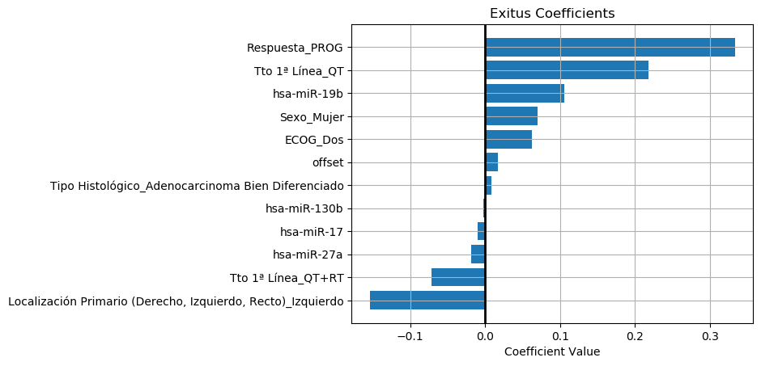
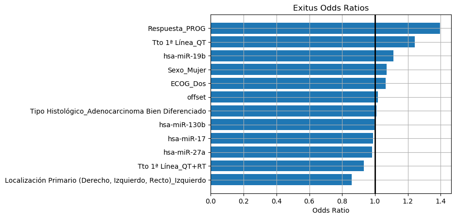
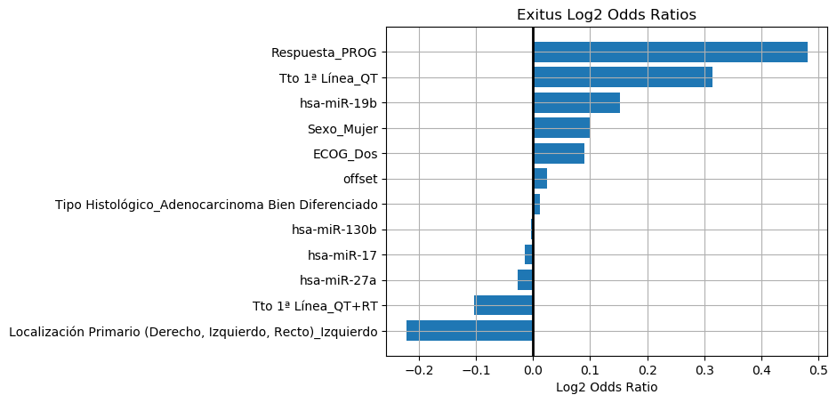
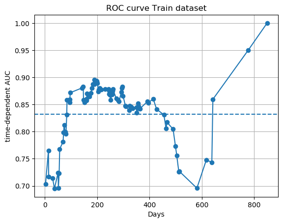
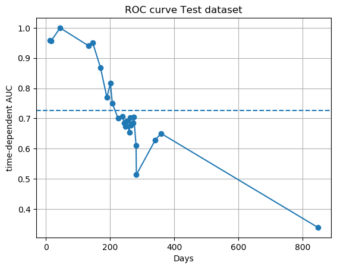
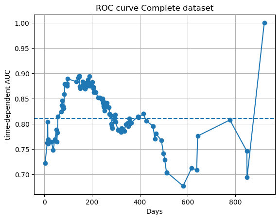
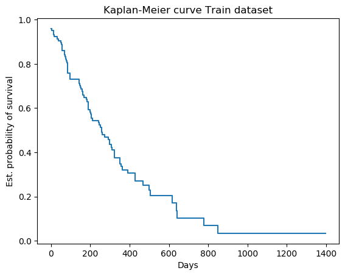
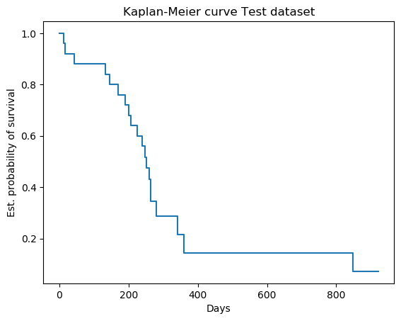
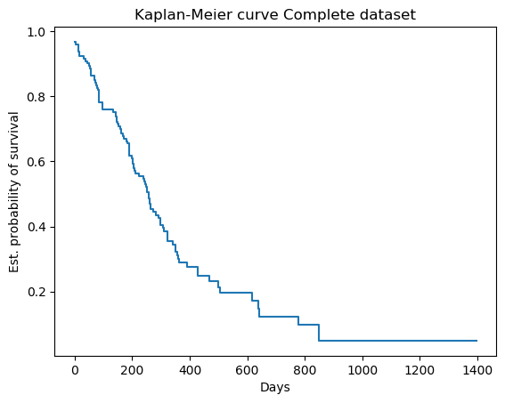

# Report
## Coefficients Info

## ROC curves single

### Parameters
- ***alpha_min_ratio:*** auto
- ***alphas:*** [0.12648552168552957]
- ***copy_X:*** True
- ***fit_baseline_model:*** False
- ***l1_ratio:*** 1.0
- ***max_iter:*** 1000000
- ***n_alphas:*** 100
- ***normalize:*** False
- ***penalty_factor:*** None
- ***tol:*** 1e-07
- ***verbose:*** False

### Process Info
Data: Encoding categorical variables with One-Hot-Encoding method  
Data: Detected 12 categorical variables  
&nbsp;&nbsp;&nbsp;&nbsp;	5 variables converted to One Hot Encoding  
Data: Detected 7 categorical variables with empty values. Use imputeEmptyValues()  
Data: Encoding categorical variables with One-Hot-Encoding method  
Data: Detected 7 categorical variables  
&nbsp;&nbsp;&nbsp;&nbsp;	7 variables converted to One Hot Encoding  
Data: Detected 0 categorical variables with empty values. Use imputeEmptyValues()  
Data: Standard scaling method performed  
Plots: Generating coefficients plot  
Plots: Generating odds ratios plot  
Plots: Generating odds ratios plot  
Plots: Generating Kaplan-Meier plot  
Plots: Generating ROC curve plot  
Report: Generating parameters report format  
Analysis: Extracting model parameters  
Report: Generating process info report format  

